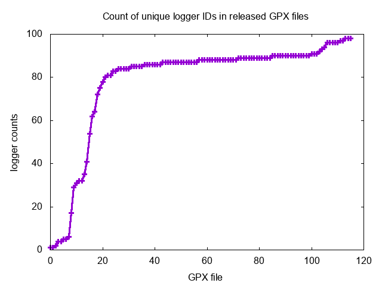

# MEVA-Data-Repo GPS

## Synopsis

During the KF1 collection, actors and personnel carried GPS loggers set to log
their location once every 10 seconds. This directory contains the GPS data
corresponding to the time windows of the released MEVA video data. This data is
released under the [MEVA license](../../LICENSE).

## Consistency of logger IDs

The KF1 collection spans two sessions, one in March and one in May (as of
this writing, only data from the March session has been released.) Within each
session, each person used the same GPS logger for all days of the collect,
with instructions to turn them on at the start of the day's activities and
off as they were leaving, resulting in consistent GPS IDs across days within
the session. GPS IDs are **not** consistent between the March and May sessions.
Logger IDs are strings of the form `Gnnn` (e.g. `G603`.) 

## GPX file contents

Each of the 116 GPX files represents a five-minute "slot" of wall-clock time,
containing all logger tracks during that slot. For example, the file
`2018-03-12.10-15-00.gpx` contains all tracks on March 12, 2018 from 10:15am to
10:20am.

## Relating GPX files to video clips

Each GPX file's time slot (e.g. `2018-03-12.10-15-00`) corresponds to entries
in the timeslot column in the file
[meva-clip-camera-and-time-table.txt](../meva-clip-camera-and-time-table.txt),
described [here](../clip-table-readme.md); this should assist aligning video
clips and GPS logs.

## Timestamps and time zones

The timestamps in the GPX files are in UTC; all other MEVA timestamps (for
example, in filenames) are in MUTC local time (UTC-4). 

## Filtering of track points

Track points have been cropped to a box around the KF1 collection zone from
(39.052214N, 85.534343W) to (39.046152N, 85.524140W); this filters out grossly
spurious readings from the logger as well as occasions when an actor may have
left the collection zone (e.g. lunch breaks.)

## Number of logger IDs per file

The number of unique loggers per file is graphed below. Very low counts
correspond to early-in-the-day time slots, as actors arrived on site and turned
on their loggers. Variations during any given day have not been thoroughly
analyzed but may be due to actors outside the filtering zone, failure to log
due to lack of signal (i.e. inside a building), or human error in forgetting
to turn the logger on.

## POC
Please send questions and comments to mevadata (at) kitware.com.

